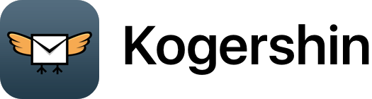
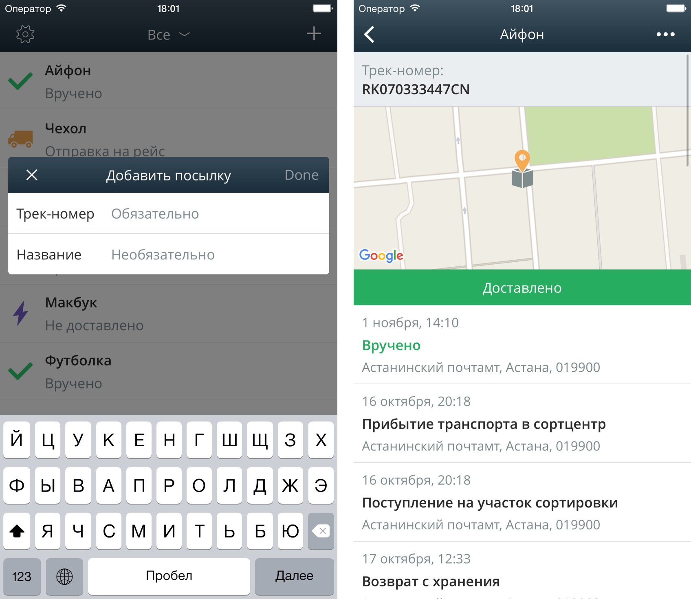

Kogershin is an iOS app that allows you to track your Kazpost parcels.



## Stack

Kogershin iOS app is written in Objective-C using the MVC architecture. It's built with [Parse SDK](https://github.com/ParsePlatform/Parse-SDK-iOS-OSX).

Kogershin backend is built on top of Parse BaaS. Unfortunately, Parse [was shut down](http://blog.parse.com/announcements/moving-on/), so this setup is not going to be functional.
You can however use the source code for you learning purposes or modify it to build a backend on [Parse Server](https://github.com/ParsePlatform/parse-server).

## Setup

1. Clone the repo:
```console
$ git clone https://github.com/yenbekbay/kogershin
$ cd kogershin
```

2. Install iOS app dependencies from [CocoaPods](http://cocoapods.org/#install):
```console
$ (cd ios && bundle install && pod install)
```

3. Configure the secret values for the iOS app:
```console
$ cp ios/Kogershin/Secrets-Example.h ios/Kogershin/Secrets.h
$ open ios/Kogershin/Secrets.h
# Paste your values
```

4. Open the Xcode workspace at `ios/Kogershin.xcworkspace` and run the app.

## License

[MIT License](./LICENSE) © Ayan Yenbekbay
